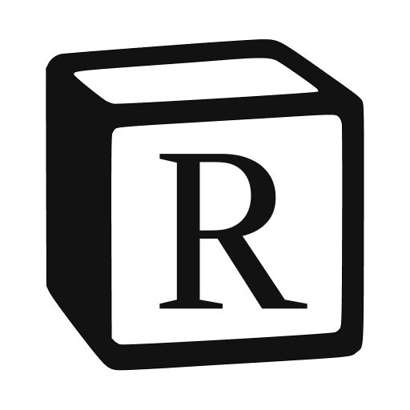

<h1 align="center">
  
</h1>

<p align="center">
  
  
  
  
  
</p>

<p align="center">
  <a href="#information_source-como-usar">ℹ️ Como Usar?</a>&nbsp;&nbsp;&nbsp;|&nbsp;&nbsp;&nbsp;
  <a href="#rocket-tecnologias">🚀 Tecnologias</a>&nbsp;&nbsp;&nbsp;|&nbsp;&nbsp;&nbsp;
  <a href="#computer-autores">💻 Autores</a>&nbsp;&nbsp;&nbsp;|&nbsp;&nbsp;&nbsp;
  <a href="#memo-licença">📝 Licença</a>
</p>

<p align="center">
  <b>Rotion</b> é uma alternativa ao Notion construída com <b>Electron, React e TypeScript</b> durante o módulo bônus do curso de <b>"Aplicações Desktop com Electron"</b> da <b>Rocketseat. 🚀</b>
</p>

---

# :information_source: Como Usar?

Clone o repositório

```bash
https://github.com/tavareshenrique/rotion.git
```

Instale as dependências

```bash
npm install
```

Execute a aplicação

```bash
npm run dev
```

# :rocket: Tecnologias

- [Electron](https://www.electronjs.org/pt/)
- [React](https://pt-br.reactjs.org/)
- [TypeScript](https://www.typescriptlang.org/)
- [React Query](https://tanstack.com/query/v3/)
- [TipTap](https://tiptap.dev/)
- [clsx](https://github.com/lukeed/clsx)
- [cmdk](https://github.com/pacocoursey/cmdk)
- [Electron Router Dom](https://github.com/daltonmenezes/electron-router-dom)
- [Electron Store](https://github.com/sindresorhus/electron-store)
- [Phosphor React](https://github.com/phosphor-icons/react)
- [TailwindCSS](https://tailwindcss.com/)
- [Vite](https://vitejs.dev/)


# :computer: Autores

<table>
  <tr>
    <td align="center">
      <a href="http://github.com/tavareshenrique/">
        
        <br />
        <sub>
          <b>Henrique Tavares</b>
        </sub>
       </a>
       <br />
       <a href="https://www.linkedin.com/in/tavareshenrique/" title="Linkedin">@tavareshenrique</a>
       <br />
       <a href="https://github.com/tavareshenrique/
                feet-app/commits?author=tavareshenrique" title="Code">💻</a>
    </td>
    <td align="center">
      <a href="https://github.com/Rocketseat/">
        
        <br />
        <sub>
          <b>Rocketseat</b>
        </sub>
       </a>
       <br />
       <a href="https://www.linkedin.com/in/tavareshenrique/" title="Linkedin">@Rocketseat</a>
       <br />
       <a href="https://github.com/tavareshenrique/go-marketplace/commits?author=tavareshenrique" title="Code">💻</a>
    </td>
  </tr>
</table>

# :memo: Licença

Este projeto está licenciado sob a licença MIT - consulte a página [LICENSE](./LICENSE) para obter detalhes.
